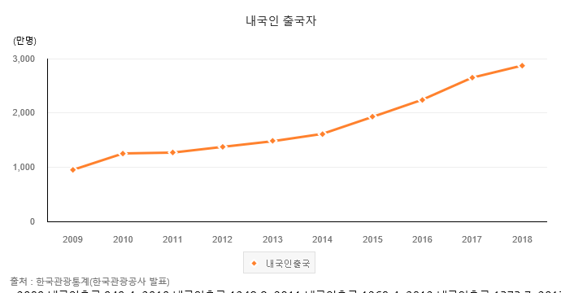
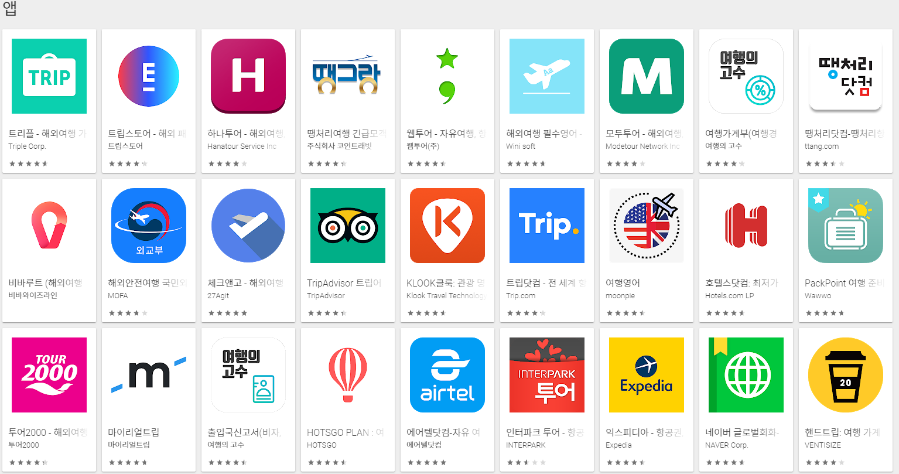
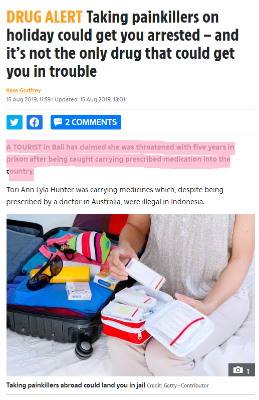
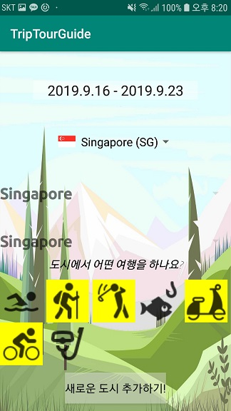
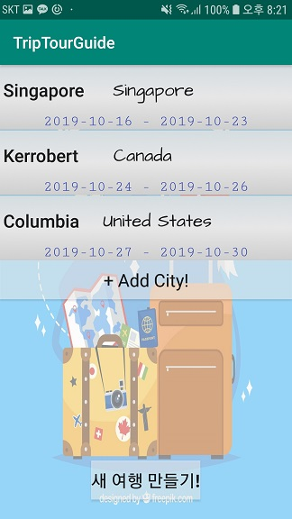
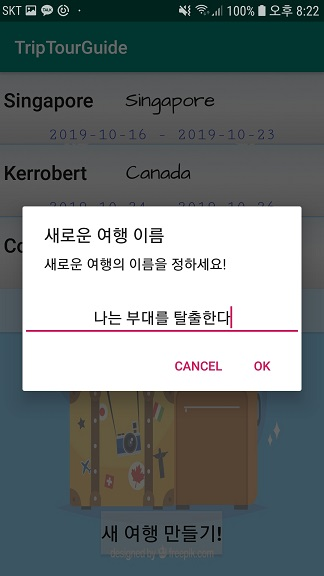
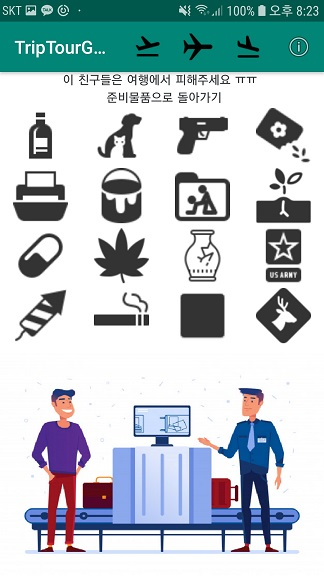
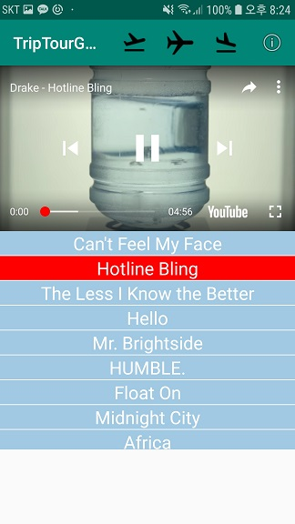
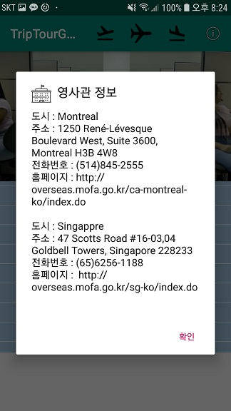
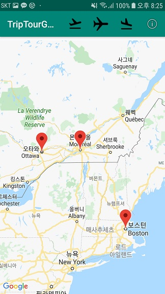

# TripTourGuide

## 소개
TripTourTravel는
- 사용자의 여행을 여행을 떠나기 전, 중, 후에 나누어 도움을 주는 안드로이드 App입니다.
- 사용자가 여행을 떠났을 때 일어날 수 있는 불행한 상황(금지 물품 반입, 챙기지 못한 준비물 등)을 예방해줍니다.
- 여행 국가의 인기 음악 Top 20를 제공함으로써 음악을 통해 현지 문화를 더 쉽고 빠르게 받아드릴 수 있게 도와줍니다.
- 다녀온 도시를 지도에 표시해 한 눈에 보여주어 사용자에게 여행을 되돌아보는 시간을 제공합니다.

## 개발배경

대한민국의 해외 관광객 수치는 매년 평균 10%의 성장률을 보이고 있습니다.

이런 수요를 바탕으로 현재 다양한 여행 관련 TV 프로그램들이 상영중입니다.

어플 시장에도 이러한 흐름에 따라 많은 어플이 나왔지만 대부분의 어플은 '예매'관련 어플이며 사용자의 여행 과정을 세밀하게 보조해주는 어플은 보이지 않았습니다.

여행국가에서 어떠한 물건이 반입이 불가한지 파악을 못하여 감옥에 가는 등 불이익을 보는 사례가 증가하고 있습니다.

따라서 저희는 사용자의 여행을 즐길 수 있게 보조하는 어플을 개발하게 되었습니다.

## 컴퓨터 구성 / 필수 조건 안내 (Prerequisites)

최소 SDK 버전 26
Android OS
Android 9.0 이상

## 설치 안내 (Installation Process)
### Android Studio가 있는경우
#### 1. 프로젝트 클론
- ` $ git clone https://github.com/osam2019/APP_TripTourTravel.git`
- ` $ cd TripTourGuide`

#### 2. Android Studio를 통한 APK 파일 생성
- Android Studio로 프로젝트 파일을 연후 Build > Build Bundle(s) / APK(s) > Build APK(s) 를 이용하여 APK 파일을 생성합니다

#### 3. APK 파일 전송
- `.\TripTourGuide\TripTourGuide\app\build\outputs\apk\release` 에서 APK 파일을 Android 기반의 모바일 디바이스로 전송하고 설치하시면 앱을 실행하실 수 있습니다

### Android Studio가 없는경우
#### 1. 프로젝트 클론
- ` $ git clone https://github.com/osam2019/APP_TripTourTravel.git`
- ` $ cd TripTourGuide`
#### 2. gradlew 다운로드
[Gradle 공식 사이트](https://docs.gradle.org/current/userguide/installation.html) 에서 가이드라인에 따라 Gradle을 설치 합니다.
#### 3. gradlew 를 이용하여 APK 파일생성
- 프로젝트 폴더로 들어간 뒤 `.\TripTourGuide` 
- 다음의 gradle 명령어를 실행합니다 `gradlew assembleRelease`
- 생성된 APK 파일을 Android 기반의 모바일 디바이스로 전송하고 설치하시면 앱을 실행하실 수 있습니다

##사용법 (Getting Started)

어플을 실행했을 때 초기화면입니다. 저장된 여행들을 리스트로 확인할 수 있습니다. '+new Trip'을 클릭하여 새로운 여행을 추가할 수 있습니다.

'+new Tip'을 클릭했을 때 실행되는 여행 추가를 위한 설정화면입니다. '+Add City!'를 클릭하여 여행을 떠날 도시를 선택하면 됩니다.

'+Add City'를 클릭했을 때 실행되는 여행 도시을 설정하는 화면입니다. 먼저 출발 및 도착 날짜를 설정합니다. 그 다음 여행국가, 주, 도시 순으로 선택을 하면 해당 도시에서 즐길 수 있는 활동(Activity)가 표시됩니다. 원하는 활동을 모두 선택한 후 '새로운 도시 추가하기!'를 클릭하여 설정을 마무리합니다.

여행을 떠날 도시를 모두 추가했을 때의 화면입니다. 여행 도시 추가를 마쳤다면 '새 여행 만들기!'를 클릭하여 떠날 여행의 제목을 설정합니다.

'새 여행 만들기!'를 클릭했을 때 실행되는 dialog입니다. 제목을 작성한 후 'OK'버튼을 눌러 여행 추가를 마무리합니다.

여행 제목을 클릭하였을 때 실행되는 챙겨야 할 준비물 리스트 제공 화면입니다. 확실하게 챙긴 준비물은 옆으로 슬라이드하여 '준비됨' 상태로 변경할 수 있습니다. 상단의 텍스트를 통해 몇 개의 준비물이 남았는지 파악할 수 있습니다.

모든 준비물을 챙겼을 때 변경된 준비물 화면입니다. 준비물을 모두 '준비됨' 상태로 변경할 시 리스트의 항목들이 투명하게 변하며 뒤의 배경 그림이 나타나게 됩니다. 또한 상단의 텍스트의 색상이 변경되며 텍스트를 클릭할 시 여행 국가에서 반입을 금지하고 있는 물품들을 볼 수 있습니다.

준비물 준비를 마치고 변경된 텍스트를 클릭할 시 실행되는 해당 국가의 반입 금지 물품 리스트입니다. 아이콘들을 클릭할 시 어떠한 물품이 왜 반입이 불가한 지에 대한 설명이 제공됩니다.

상단의 ActionBar에서 두번째 아이콘을 클릭할 시 실행되는 현지 인기 음악 재생 화면입니다. 위 화면에서는 여행을 가는 국가의 인기 음원 차트를 'Last.fm'에서 API를 통해 받아옵니다. 그 차트에 실려있는 음악은 'Youtube'를 통해 재생목록을 생성 및 동영상을 재생합니다.

상단의 ActionBar에서 마지막 아이콘을 클릭할 시 실행되는 dialog입니다.  여행을 가는 도시에서 불행한 상황이 발생했을 시 도움을 청할 수 있는 영사관의 정보를 제공합니다.

상단의 ActionBar에서 세번째 아이콘을 클릭할 시 실행되는 여행 도시를 지도에 표시해 주는 기능입니다.  'Google Map'의 API를 활용한 기능이며 어떤 도시를 여행했는지 지도를 통해 사용자에게 한눈에 표시해줍니다.

## 파일 정보 및 목록 (File Manifest)
- MarkedMapFragment - Google Map 서비스를 생성하는 프레그먼트 입니다
- PrepItemFragment - 아이템 준비물 리스트와 뷰를 생성하는 프레그먼트 입니다.
- ProhebitItemFragment - 여행 금지 물품 리스트를 생성하는 프레그먼트 입니다
- YoutubeFragmentX - 뮤직비디오 재생을 위한 유튜부를 구현하는 프레그먼트입니다
- ActivityListGriViewAdapter - 여행지에서 가능한 여러 활동들을 이미지로 구현하는 어뎁터입니다
- TripCreatorListAdapter - 새로운 여행을 만들때 현재 등록한 도시목록을 저장하는 어뎁터입니다
- YtListener - 유튜브 플레이어로 부터 플레이 리스트 업데이트 활동을 감지하고 뮤직비디오 리스트 뷰를 관리하는 리스너 입니다
- YtPlayerDtateChangeListener - 유튜브 관련 상태변화를 감지하고 뮤직비디오 리스트 뷰를 업데이트 하는 리스너 입니다
- DBopenHelper - SQLite 데이터베이스와 연결하고 앱실행에서 데이터 베이스 연결과 관련된 함수들을 포함하는 클래스입니다
- MainActivity - 앱의 기본화면을 제공하고 현재 만들어놓은 여행들을 보여줍니다
- MusicRankCollector - 각 국가별 음악 랭킹 차트를 API를 통해 가져옵니다
- TripCreator - 새로운 여행을 만들때 필요한 뷰와 기능들을 제공합니다
- TripNameClickedListener - 새로운 여행을 만들때 여행이름을 전달받는 리스너 입니다
- TripServiceProvider - 앱이 제공하는 여러 서비스들의 모체가 되는 Activity입니다
- TripSettings - 새로운 여행을 만들시 각각의 도시를 생성하는 객체입니다
- TripUtils - 앱에서 필요한 몇가지 유틸 기능들을 제공합니다.

## 저작권 및 사용권 정보 (Copyright / End User License)

계발목표가 오픈소스아카데미인 만큼 사용, 수정, 배포가 가능합니다.

Copyright 2019 

Licensed under the Apache License, Version 2.0 (the "License");
you may not use this file except in compliance with the License.
You may obtain a copy of the License at

    http://www.apache.org/licenses/LICENSE-2.0

Unless required by applicable law or agreed to in writing, software
distributed under the License is distributed on an "AS IS" BASIS,
WITHOUT WARRANTIES OR CONDITIONS OF ANY KIND, either express or implied.
See the License for the specific language governing permissions and
limitations under the License.

## 배포자 및 개발자의 연락처 정보 (Contact Information)

[김기태](https://github.com/gth1030) 
010-4817-9203

[하혜성](https://github.com/minicomet)
010-2083-5880

## 알려진 버그 (Known Issues)

Google Youtube API Quota exceed error - 앱 실행후 앱이 유투브에서 곡 이름을 검색하여 가져오는데 Youtube API가 사용됩니다. 다만 매일 할당된 Quota양이 상당히 작기 때문에 Quota가 넘어가면 검색이 안되고
새로운 국가의 노래에 대한 Youtube 비디오 id를 가져오지 못하는 상황이 발생합니다.
해결방법: 현재 앱에서는 하나의 국가에 대해 한번이라도 API 콜을 실시하면 그것을 내부 SQLite 데이터 베이스에 저장을 하여 반복된 콜로 인한 quota 낭비를 방지합니다. 이것은 추후 별개의 서버를 구축하여 
거기에 국가별 비디오 id를 저장함으로서 quota에 상관없이 최신 뮤직비디오의 비디오 ID를 가져올수 있게 됩니다.

데이터 부족으로 인한 서비스 제한구역존재 - 현재 앱에 존재하는 데이터의 부족으로 미국, 캐나다, 싱가포르 몇 도시를 제외한 다른 지역은 서비스를 재대로 제공하지 않습니다. 
해결방법: 이 문제는 추가적인 데이터를 수집하여 앱에 접목함으로 쉽게 해결될 수 있습니다.

## 문제 발생에 대한 해결책 (Troubleshooting)
Google Youtube API Quota exceed error - 이 문제에 대한 해결방법은 일단 Quota가 가득찰시 앱은 내부 데이터 베이스에 저장되어있는 값을 이용하여 비디오 주소를 가지고 오거나 그것마져 없다면 앱에 미리 적어놓은 
기본값을 가지고 와서 뮤직비디오를 실행합니다. Quota가 떨어졌을때 네트워크로 값을 가져오기 위해서는 그 다음날이 되어 구글에서 새로운 Quota를 제공해 줄 때까지 기다려야 합니다.

데이터 부족으로 인한 서비스 제한구역존재 - 추후 앱을 업데이트 할때까지 서비스 구역이 제한됩니다.

## 크레딧 (Credit)
> 계발자 김기태
계발자 하혜성

이미지 및 아이콘 출처
https://www.freepik.com/
https://icons8.com/
http://overseas.mofa.go.kr/sg-ko/index.do
http://overseas.mofa.go.kr/us-ko/index.do
http://overseas.mofa.go.kr/ca-ko/index.do

## 업데이트 정보 (Change Log)

